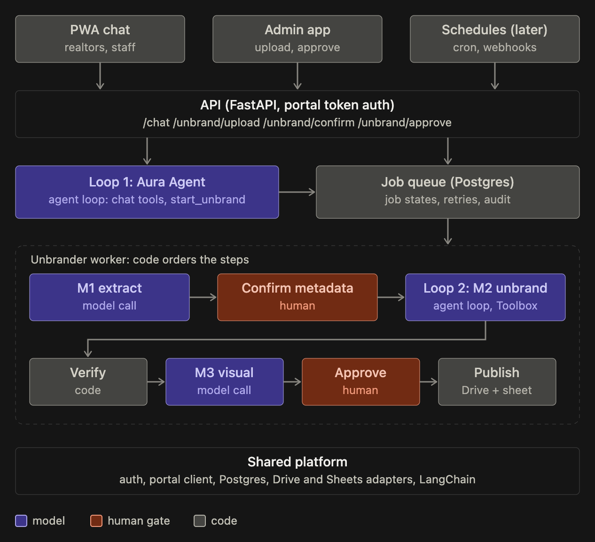

# Phase 2 — Loop and architecture

Patterns applied: 2 (evolve architecture), 5 (parallelize carefully), 6 (share context).
State: PROPOSED (defaults accepted by the operator; review before build).


## Decision

A deterministic job pipeline inside Aura Chat (`aura-chat/`), with a model called at exactly
three points. The orchestrator is code, not a model. No router, no coordinator: there is one
capability.

Aura Chat becomes write-capable with this feature (decision D1, 2026-10-05). The chat agent
stays read-only; writes happen only in this pipeline, only by code, and the public ones only
after a human approves.

## The loop

```
UI upload ──► RECEIVED
               │ code: validate files (input guardrails, SECURITY.md)
               ▼
           EXTRACTING_METADATA ........ model (M1): propose project, builder, short forms,
               │                         city, and document type per file
               ▼
           AWAITING_METADATA_CONFIRM .. human: confirm or edit on the form
               │
               ▼
           UNBRANDING (per document) .. model (M2) calling the named PDF tools below;
               │                         the tools are our code, run in Aura Chat
               ▼
           VERIFYING .................. code: text sweep, word provenance, number integrity,
               │                         PDF metadata strip
               │                         model (M3): visual check of the rendered pages
               ▼
           FILED_PRIVATE .............. code: create folders, upload to Drive, link private
               │
               ▼
           AWAITING_APPROVAL .......... human: approve or reject with a reason
               │            └──► REJECTED ──► re-run with notes (once) or MANUAL
               ▼
           PUBLISHED .................. code: set "anyone with the link can view",
                                        write the link into the UNBRANDED cell,
                                        notify the uploader
```

Any step can move the job to `FAILED` (see OPERATIONS in SECURITY.md).

## Deterministic or model

| Step                                          | Kind         | Why                                                                                   |
| --------------------------------------------- | ------------ | ------------------------------------------------------------------------------------- |
| Validate upload                               | Code         | File type, size, page count, encryption are checkable                                 |
| M1 Extract metadata and classify documents    | Model        | Unstructured PDF text; output is a schema, confirmed by a human                       |
| Confirm metadata                              | Human        | A wrong builder name makes the unbrander miss the real branding                       |
| M2 Unbrand                                    | Model + code | Model judges what is branding and calls a named tool; the tool (`pymupdf`) removes it |
| Verify (text, provenance, numbers, metadata)  | Code         | All four are exact comparisons; no judgement needed                                   |
| M3 Visual check                               | Model        | Logos, monograms and QR codes are only visible in the render                          |
| Folder create, upload, share, portal register | Code         | Fixed rules from configuration                                                        |
| Approve                                       | Human        | Last gate before public exposure                                                      |

## Structure

- **Per document, a fresh model context.** Each document in a job is unbranded in its own
  context (a subagent, in Claude Code terms). Documents in one job are independent once the
  metadata is confirmed, and a fresh context avoids rot across a 40-page site plan plus three
  floor plans (pattern 7). The shared facts every document needs — project, builder, short
  forms, hit list — are passed explicitly (pattern 6).
- **Sequential, not parallel.** At 5 to 10 documents per day, parallel runs buy nothing and
  make the logs harder to read. Process documents in a job one after another.
- **Intake is an adapter.** The pipeline starts at `RECEIVED` with a job record. The UI
  upload is the v1 adapter; a WhatsApp listener is a later adapter that creates the same
  record. Nothing after `RECEIVED` knows the source.
- **Queue is Postgres** (decision D6). Job records live in a `jobs` table in the existing
  Railway Postgres. A worker claims the next job with `SELECT … FOR UPDATE SKIP LOCKED`. No
  new service. At 5 to 10 documents a day one worker is enough.

## M2 tools (decision D3)

Claude does not write code. It sees page renders and text, decides, and calls these tools.
Each tool is a plain Python function in Aura Chat built on `pymupdf` (and `reportlab` for
price lists). They carry the logic of the `unbrand-builder-docs` skill; the skill's prose
becomes the M2 system prompt.

| Tool                             | Does                                                                                                                                | Guard inside the tool                                                                      |
| -------------------------------- | ----------------------------------------------------------------------------------------------------------------------------------- | ------------------------------------------------------------------------------------------ |
| `render_page(page)`              | 100 DPI image of one page, plus the ids and boxes of its images                                                                     | At most 3 renders of any one page                                                          |
| `get_text(page)`                 | Extracted text, delimited as data                                                                                                   | —                                                                                          |
| `redact_terms(terms[])`          | Removes every whole-word match on every page (text only; plan line art kept)                                                        | Rejects a term not in the source's text layer; logs every removed match                    |
| `redact_rect(page, box)`         | Removes a logo, QR, monogram or brand panel                                                                                         | Rejects a box over half the page; reports and logs any other words it removed              |
| `delete_image(page, image_id)`   | Removes one embedded image, on every page that draws it                                                                             | Rejects an image over half the page (a flattened plan is one image); names the other pages |
| `drop_page(page, reason)`        | Removes a marketing-only page                                                                                                       | Reason required; the last page cannot go; listed for the approver                          |
| `replace_line(page, rect, text)` | Sentence repair after a removal                                                                                                     | Rejects any word not in the source                                                         |
| `add_mark(position)`             | Aura Key mark, same position on every page                                                                                          | `bottom_right` or `bottom_centre`; once per document                                       |
| `rebuild_price_list(rows)`       | House-style price list                                                                                                              | Rejects any number not in the source                                                       |
| `verify()`                       | Text sweep, raw-object sweep, OCR sweep (3 modes), number integrity, provenance, metadata strip, cover-up, page sizes (AUTONOMY.md) | Code only; results stored on the document record                                           |

Built so far (U2 step 1): every row above except `replace_line` and `rebuild_price_list`, in
`tools.py` over the `PdfEditor` port. Conventions:

- **Pages are source numbers** for the whole run. A dropped page is removed, and the mark
  added, only when the document is saved, so a number never shifts under the model and a
  later redaction cannot remove the mark.
- **Boxes are on a 0–1000 grid** over the page, `[x0, y0, x1, y1]`: the grid Gemini emits
  natively, and independent of render DPI.
- A refused call raises `ToolRejected` before anything changes; the loop returns the reason
  to the model as the tool's error.
- **`finish()` is code, not a model tool.** It saves the document, then strips the info
  dict, the XMP (the catalog's and every object's), annotations, links, attachments and layer
  names. Hidden text stays: in a scan it is the OCR layer that keeps prices searchable. It hands `dropped_pages` and the removal log to `verify()` and the
  approver.

There is no tool to run code, read files, or reach the network. Reference for tool shape:
[pdf-redaction-mcp](https://github.com/marc-hanheide/pdf-redaction-mcp) (MIT, inactive),
read for ideas only, not a dependency.

## Who does the writes (decisions D2, D7)

After approval, Aura Chat's own code creates the folders, uploads, sets sharing and writes
the sheet, directly through the Google Drive and Sheets APIs, behind a `GoogleWriter` port.
The model never calls it.

Rejected (2026-10-06): a new Apps Script action. It needed no new credential, but Apps
Script caps a request near 50 MB and a run at 6 minutes, so a large site plan sent as base64
could fail, and every write would need a clasp deploy. The Drive API's resumable upload has
no such limit.

The write is to the project row's existing `UNBRANDED` cell (D4), which the portal already
shows as the "Drive" button. An empty cell means a new project; a filled cell means an
update (AUTONOMY.md).

## UI (decision D9)

A separate admin app, not a PWA screen: the first piece of the Aura Agent UI. Three screens
for this feature — upload with the metadata form, job list, approval with before and after
page images. It signs in through Aura Chat's `/login` and is shown to the admin role only.
Stack: Vite + React + TypeScript, deployed as its own Railway service (D14).

## Job record

```
job_id, created_at, uploader, source ("ui" | "whatsapp" later)
metadata: project, builder, short_forms[], city, province (default "Ontario"),
          extracted_by_model (copy of M1 output), confirmed_by, confirmed_at
documents[]: source_file_id, sha256, doc_type (price_list | floor_plan | site_plan |
             feature_sheet | other), status, output_file_id, pages_dropped[],
             removed_items[], flags[], verify_results
drive: project_folder_id, share_link
portal: row_ref (project row; link goes in its UNBRANDED cell)
approval: approved_by, approved_at | rejected_by, reason_tag, notes
audit[]: every action (see OPERATIONS)
```

## Drive filing rule (from configuration)

```
<UNBRANDED_ROOT>/<province>/<city>/<project> - <builder>/
    <price list>                     at the project folder root
    Floor Plans/<floor plans>        when there is more than one floor plan
    <single floor plan>              at the root when there is only one
    <site plan, feature sheet>       at the root (PROPOSED; confirm with the team)
```

Folder names, the root folder ID and the province list are configuration.

## Rejected

- A model as orchestrator (an agent that "decides" to upload, share, publish). The order
  never changes; a model there only adds nondeterminism and an injection path.
- Parallel per-document subagents. No speed need at this volume.
- A separate Unbrander agent outside the portal. The portal already owns Drive access and
  the sheet; a second system would duplicate both.
- Running the skill as-is through the Claude API code-execution tool. Its sandbox has no
  network and no `pymupdf`, so the skill's `pip install` step fails; and model-written code
  is an injection path from PDF text (checked 2026-10-05 against the API docs).
- Our own code-execution sandbox on Railway. Works, but must be built and secured; named
  tools give the same result with a smaller attack surface.

## Open questions

1. Where site plans and feature sheets go in Drive (default above).
2. Whether a job may contain documents for more than one project (default: no, one job = one
   project).
3. How a job finds its project row when the project is not in the sheet yet.
